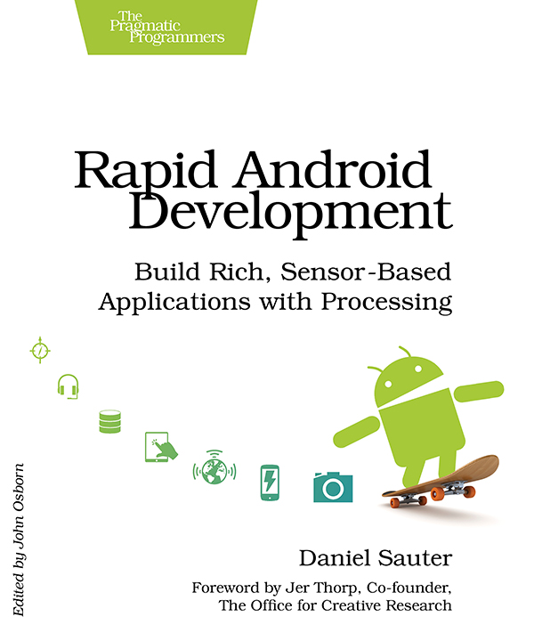

####What You Need
To use the library for Processing, make sure your setup meets the following minimum requirements:-  
<!-- <h4> -->

<ul>
<li>
- [ Processing 3.0 ](https://processing.org/download/ "Download Processing (current pre-release is 3.0a8), using Java 1.7")
</li>
<li>
- [ Android ](http://developer.android.com/sdk/index.html#Other "Android 4.0 Ice Cream Sandwich")
</li>
</ul>

<!-- </h4> -->
The newer versions of the requirements will be fine. 

####Steps
1. Install Android SDK. Follow the steps outlined in Processing Android Wiki at **[http://wiki.processing.org/w/Android#Instructions](http://wiki.processing.org/w/Android#Instructions)**

2. If you have Android versions 4.0 or higher, you can install the library release from within Processing IDE. Go to Sketch <i class="fa fa-long-arrow-right"></i>Add Library <i class="fa fa-long-arrow-right"></i>Import Library and search for "Ketai". Select the library and click on install.

3. In Processing IDE, choose "Add mode" from the menu to install Android mode.

4. Android OS might sometimes have dependecies specific to your system setup. To install Windows USB Driver, **[click here](http://developer.android.com/tools/extras/oem-usb.html)**. To setup your device for Linux, follow the instructions **[here](http://developer.android.com/tools/device.html#setting-up).**

#### Write your first sketch
1. Launch Processing application. Once it launches an empty sketch window, switch to Android Mode

2. Type the following code in the editor
	
		void draw() {
		        ellipse(mouseX, mouseY, mouseX-pmouseX, mouseY-pmouseY);
		}

3. Put your Android device in "USB Debugging" via "Developer options"

4. Plug your device into your Desktop and run the sketch from Processing. Your sketch should run on the Android Device.

####Documentation
The following book includes a comprehensive introduction to the ke:tai library with more than 40 projects.

The book comes with project source code, and is available at the **[The Pragmatic Bookshelf](https://pragprog.com/book/dsproc/rapid-android-development)**

